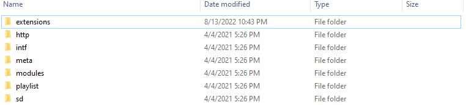
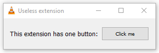

</img>

# VLC useless extension

Extension was created as a result of my curiosity. I wanted to know how to create a VLC extension/plugin. As the name would suggest, this simple extension does absolutely nothing. I will probably use the gained knowledge of the Lua language to create an actual useful extension in the future.

## Instalation

In order to install the extension in .lua go to the file path <i>C:\Program Files\VideoLAN\VLC\lua</i>. Inside the lua folder, create another folder by name “extensions”. Now copy the “useless.lua” file inside it. Once the lua file is copied, the extension will be uploaded and installed.

## Screenshot

